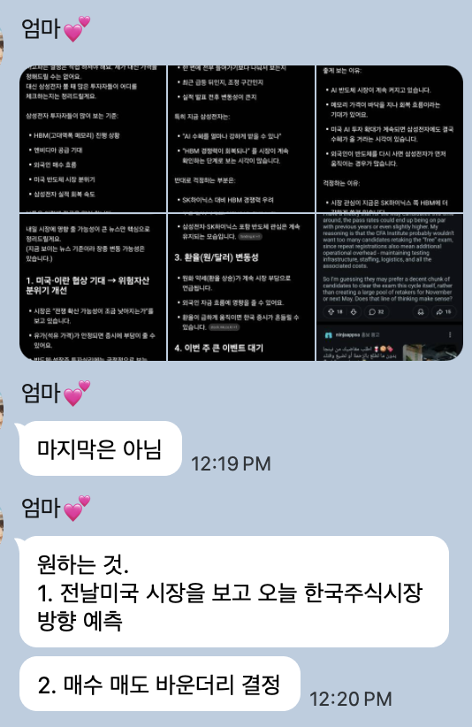
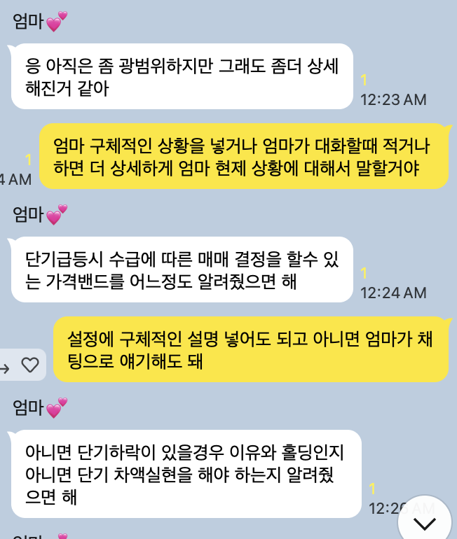
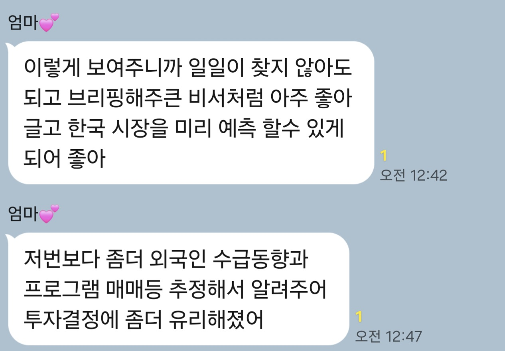
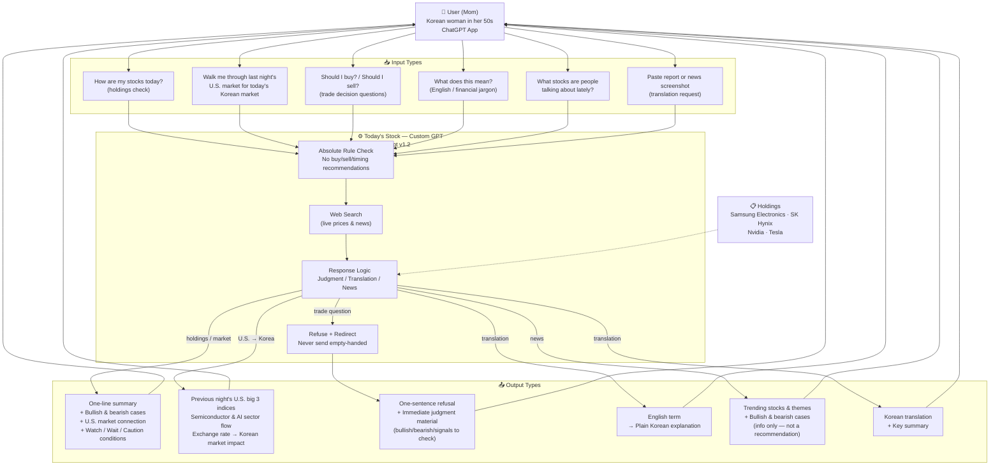

# Today's Stock (오늘의 주식) — AI 201 Project 3

> **Live GPT:** https://chatgpt.com/g/g-6a14650964dc8191b2525396adaab15a-oneulyi-jusig-today-s-stock
>
> A stock information Custom GPT built for a Korean woman in her 50s. It doesn't make investment decisions for her — it lowers the cost of making them herself.

---

## 1. Design Argument

→ Full document: [`Design_Argument.md`](./Design_Argument.md)

**Thesis:**
My mom is not someone who can't use AI. She just never had a tool set up for the specific task of following the stock market. Give her the right tool for the right task, and she'll use it — she's already proven that with ChatGPT at the doctor's office.

**The Person:**
My mom is a Korean housewife in her 50s who started learning about stocks to gain financial independence. Every day she watches Korean investment YouTube channels, joins live streams, and reads news. She knows AI exists and is powerful, but it feels like something for younger generations — so she sticks to what feels familiar. She's not afraid of AI, but the entry barrier felt high, and when she did try asking ChatGPT about stocks, she kept getting "that's your decision to make" and walked away with nothing.

**The Problem:**
U.S. market news comes in English, which is hard to parse. There's too much information. She didn't know how to write prompts that got useful answers. When she tried, the GPT refused and sent her away empty-handed. But the same mom uses ChatGPT successfully at the doctor's office — because that task is bounded and clear. The problem wasn't the person. The problem was that no one had set up the tool for this specific task.

**What "Helped" Looks Like:**
Mom spends less time searching across multiple YouTube videos. She can get a market read without the research spiral. Most tellingly: she started having back-and-forth conversations with the GPT — follow-up questions, natural dialogue — instead of one-way "translate this" commands. She's treating it as her tool now.

**Platform Rationale:**
Dad's company provides ChatGPT Plus. Mom was already using that account for hospital translations. Zero new apps, zero new logins, zero new learning. The platform wasn't chosen for features — it was chosen because it's already in her hands.

**Why Me:**
I use AI every day and it's made a lot of things easier. Watching mom study stocks through YouTube, I kept thinking: she could just ask AI to do this. But she didn't know how. I did. I'm also her daughter — I could sit with her, watch how she actually uses it, and hear real feedback instead of guessing. And honestly, AI is only going to become more present in everyday life. I wanted to help her feel less left behind by it.

---

## 2. Research Documentation

→ Full document: [`Research_Documentation.md`](./Research_Documentation.md)

**Key direct quotes:**
- *"I asked but it just told me to decide on my own?"*
- *"What I want: 1. Look at the U.S. market from the night before and predict the direction of the Korean stock market today"*
- *"2. Decide buy/sell boundaries"*
- *[flight incident]* Asked ChatGPT to "find me the cheapest flight" → told to find it herself → gave up

**Key findings:**
- **Finding A:** Mom isn't someone who "can't use AI" — she uses it for simple, bounded tasks like hospital translation. Anything more complex (stock analysis, finding flights, open-ended research) she struggled with. The task complexity, not the person, is what determined success.
- **Finding B:** What mom wants most (buy/sell signals) = what the GPT legally cannot give (investment advice). Central design conflict.
- **Finding C:** Chat, not voice — mom said "chat is more comfortable" and has never used voice mode. Interview data beat demographic assumptions.
- **Finding D:** "Make the decision yourself" alone isn't enough. The refusal has to come with judgment material, immediately.

---

## 3. Platform Rationale

| Reason | Basis |
|--------|-------|
| Mom already uses ChatGPT | Zero new apps, logins, or learning curve |
| Dad's company subscription | $0 permanently, continues after the project ends |
| Mature Custom GPT ecosystem | System prompt, knowledge files, shareable link |
| Narrative | "Turning a company perk back into something for the family" |
| Feature config | Web search on — live news & prices are the core function |

---

## 4. Shipped Product

**Live URL:** https://chatgpt.com/g/g-6a14650964dc8191b2525396adaab15a-oneulyi-jusig-today-s-stock

**GPT Name:** 오늘의 주식 (Today's Stock)

**Core capabilities:**
- Holdings summary (Samsung Electronics, SK Hynix, Nvidia, Tesla) with latest news
- Previous night's U.S. market → today's Korean market context brief
- Trade decision questions → refuse + immediate judgment material (never empty-handed)
- English / financial jargon → plain Korean explanation
- Trending stock & theme roundup (information only, no recommendations)

---

## 5. User Testing Evidence

→ Full document: [`User_Testing_Evidence.md`](./User_Testing_Evidence.md)

**Test 1 — First Contact, GPT v1.1**

Mom opened the GPT independently and entered stock questions. GPT responded: "Investment decisions are yours to make." Mom did not follow up.

Feedback: *"I asked but it just told me to decide on my own?"* — identical pattern to the flight incident that originally made her give up on ChatGPT for stocks.

**Observations:**
- ✅ Worked: Mom accessed and used the GPT with zero platform friction
- ❌ Failed: Refuse-only structure sent her away empty-handed
- 💡 Surprising: She didn't want "buy this" — she wanted context and conditions. That's something the GPT can actually provide.

**Iteration → v1.2:** Added refuse + redirect structure, judgment-oriented answer format, updated conversation starters to match what mom actually asked for.

**Environment Photo — Mom using the GPT**

*Mom's phone showing the GPT response to "가격밴드결정해줘" (decide the price band for me). The screen shows the v1.2 refuse + redirect structure in action: one-sentence refusal → immediate judgment material with watch/wait/caution bands. Photo taken with permission.*

---

**Test 2 — Second Test, GPT v1.2**

Mom used the GPT independently for a real stock she had just purchased (LG이노텍, ₩920,000). Key quotes:
- *"이렇게 보여주니까 일일이 찾지 않아도 되고 브리핑해주는 비서처럼 아주 좋아"* — "It's like having a briefing secretary, I don't have to search one by one anymore"
- *"저번보다 좀더 외국인 수급동향과 프로그램 매매등 추정해서 알려주어 투자결정에 좀더 유리해졌어"* — "Better than last time for investment decisions"

Instead of walking away (Test 1), mom sent follow-up feature requests — engagement over abandonment.

**KakaoTalk feedback screenshots** (Korean — translations provided inline above):

*Test 1 feedback: "I asked but it just told me to decide on my own?" — triggered the v1.1 → v1.2 rebuild.*

*Test 2 feedback: "It's like having a briefing secretary — I don't have to search one by one anymore."*

*Final feedback: Mom confirmed satisfaction after the iteration. Used the GPT for a real purchase decision (LG이노텍, ₩920,000).*

---

## 6. Mermaid Diagram

→ File: [`Mermaid_Diagram.mermaid`](./Mermaid_Diagram.mermaid)

---

## 7. AI Direction Log

**Entry 1 — Rejected platform suggestion: Gemini/Claude → stayed with ChatGPT**
AI gave me a feature comparison recommending Gemini or Claude as potentially more flexible. I rejected it. The comparison was accurate but missed the point — mom is already using ChatGPT for doctor visits. Zero new apps, zero new logins, zero new learning is a user context constraint, not a feature spec. Kept ChatGPT Custom GPT.

**Entry 2 — Rejected all-in-one GPT → rebuilt as topic-specific GPT family**
AI suggested an all-in-one "Mom GPT" combining stocks, travel, and health in one place. I rejected it. Different tasks carry different vocabulary and expectations — mixing them creates confusion for a user whose mental model shifts by task. This connects directly to the project thesis. Built Today's Stock as the first instance of a topic-specific GPT family.

**Entry 3 — Rejected "recommended stocks" starter → "trending stocks" informational framing**
AI wrote a conversation starter: "What stocks are worth paying attention to right now?" I rejected it. "Worth paying attention to" implies a recommendation — which could constitute unlicensed investment advice under Korean financial law. Replaced with "What stocks are people talking about lately?" Same information, no recommendation implied.

**Entry 4 — Redirected system prompt v1.1 fix → rebuilt refusal structure from scratch**
After First Contact, AI suggested softening the refusal language. I changed direction entirely — not softer wording, but a new structure where every refusal is immediately followed by judgment material (refuse + redirect). Mom's feedback wasn't a tone problem; it was a structural one. She left empty-handed. The fix had to be structural.

**Entry 5 — Rejected voice mode suggestion → locked in chat**
AI suggested voice search or voice mode might be more natural for users in their 50s than typing. I rejected it. Mom explicitly said "chat is more comfortable" and has never used voice mode. User interview data beats demographic assumptions every time.

**Entry 6 — Rejected report-style answer format → judgment-oriented response structure**
AI gave me a standard stock analysis report format (background → current situation → outlook). I rebuilt it as: one-line summary → bullish reasons → bearish reasons → signals to check → watch/wait/caution conditions. Report format is how analysts write. Mom needs a quick read, not a report.

**Entry 7 — Rejected Knowledge File upload → direct system prompt embed**
AI suggested uploading mom's holdings as a separate Knowledge File. I rejected it. Knowledge Files use search-based retrieval — overkill for a list of 4 stocks. Embedded directly in the system prompt as plain text. Simple when simple is correct is also an editorial call.

---

## 8. Records of Resistance

**Resistance 1 — Rejected KakaoTalk bot → ChatGPT Custom GPT**
AI gave me an automated system that pushes stock information to mom through KakaoTalk. I rejected it. Automatic push is information overload — which is exactly the problem we're solving, not adding to. Also, a KakaoTalk bot has maintenance costs. Dad's ChatGPT Plus is already paid for and already in mom's hands.

**Resistance 2 — Rejected allowing buy/sell recommendations → kept the absolute rule**
AI framed providing "directional signals" as "judgment support" — implying limited buy/sell guidance might be acceptable. I rejected it. Under Korean financial law, unlicensed investment advice is illegal regardless of framing. And mom would trust what the GPT says, which makes any harm real. The boundary stays firm.

**Resistance 3 — Rejected Gemini/Claude → kept ChatGPT**
AI recommended Gemini or Claude as potentially more flexible after a feature comparison. I rejected it. Mom is already using ChatGPT successfully at the doctor's office. Best tool = the one she already opens. Platform chosen for existing habit, not feature ranking.

**Resistance 4 — Rejected automated morning briefing → kept pull-based structure**
AI suggested scheduling a daily automatic stock briefing pushed to mom every morning. I rejected it. "There's too much news" is one of mom's core pain points. An automatic daily push recreates that pain. Mom opens the GPT when she wants it — she stays in control.

**Resistance 5 — Rejected all-in-one GPT → topic-specific GPT family**
AI gave me an "all-in-one Mom GPT" covering stocks, travel, and health. I rejected it. In a stock GPT, "how's it looking today?" means market conditions. In a travel GPT, it could mean weather. Users whose mental models shift by task need tools that shift by task too. This is the thesis made structural.

**Resistance 6 — Rejected "recommended stocks" starter → "trending stocks" informational framing**
AI wrote "What stocks are worth paying attention to right now?" I rejected it. "Worth paying attention to" reads as a recommendation and conflicts with the absolute rule from the first message mom sees. Replaced with "What stocks are people talking about lately?" — same information, no advice implied. One word, one legal line.

---

## 9. Five Questions Reflection

**Can I defend this?**
Yes. Every decision in this project traces back to mom specifically — not to a general "50-something Korean user." The platform is ChatGPT because she was already using it, not because it scored highest in a feature comparison. The no-recommendations rule exists because of Korean financial law and because mom would trust what the GPT says. Chat over voice because she said so in the interview. The conversation starters are the exact things she told me she wanted after First Contact. Every time I had to choose, I asked: does this come from knowing her, or from assuming?

**Is this mine?**
The design decisions are mine. I rejected the all-in-one GPT, the KakaoTalk bot, the voice mode, the recommendation framing, the report-style answer structure — all of them came from AI, and I pushed back on all of them with reasons grounded in the research. The Design Argument came from my answers to questions about my mom — my observations, my reasoning, my relationship with her. AI organized the words. The thinking was mine.

**Did I verify?**
Yes. Two rounds of testing with mom on her actual device. First Contact (v1.1) failed — she walked away with nothing, same pattern as why she gave up on ChatGPT for stocks originally. That failure drove the v1.2 rebuild. The second test used v1.2 on a real stock she had just purchased (LG이노텍, ₩920,000). She called it "like a briefing secretary" and said it's better than searching one by one. She sent follow-up feature requests — which means she engaged instead of giving up. A final check confirmed she was satisfied with the result. The loop was closed.

**Would I teach this?**
The thing worth teaching is that the hardest design problem in this project wasn't technical — it was the central conflict between what mom wanted most (buy/sell signals) and what the GPT legally couldn't give her. The resolution wasn't to ignore one side or the other. It was to reframe: don't substitute the decision, lower the cost of making it. That's a transferable idea. When what the user wants and what you can give are in direct conflict, the answer is usually somewhere in the middle — and finding that middle is the design work.

**Is my disclosure honest?**
Yes. The AI Direction Log and Records of Resistance document what actually happened — including the moments where AI's suggestions were good and I kept them, and the moments where they missed the point entirely. The First Contact result is recorded as it happened, including that v1.1 failed in the exact same way that made mom give up on ChatGPT for stocks in the first place. I didn't clean that up.

---

## 10. Post-Mortem

**What Worked**

Choosing the platform mom was already on was right. In First Contact, she accessed the GPT independently and asked a question. Her feedback wasn't "I don't know how to use this" — it was "I asked but it just told me to decide on my own?" That's the feedback of someone who knows how to use the tool. Platform friction was zero. The interviews and First Contact also confirmed all four research findings in the field — especially Finding B (the central design conflict), which v1.2's refuse + redirect structure directly addressed. And every time I pushed back on AI's suggestions, there was a better reason to — each rejection led to a real product change. By the second test, mom called the GPT "like a briefing secretary" and used it for an actual purchase decision (LG이노텍, ₩920,000). She sent follow-up requests instead of walking away. That shift was the clearest evidence it worked.

**What Didn't Work**

v1.1's refusal structure recreated the "flight incident" — the same reason mom gave up on ChatGPT for stocks originally. "Investment decisions are yours to make" was legally correct but functionally useless. It took putting the prototype in front of mom to see it. The thesis also took six evolutions to stabilize (KakaoTalk digest → bot → invisible AI → all-in-one GPT → unified mom GPT → topic-specific GPT family), which put the project about a week behind schedule and compressed everything after First Contact.

**What I'd Do Differently**

First Contact earlier — even a rough prototype, handed over sooner. The most useful data came from mom using it, not from building in isolation. And I'd capture exact verbatim quotes from the very first interview. Several quotes in the research documentation are paraphrased. Exact wording is what makes research documentation credible.

**Designing for a Real Person vs. a Hypothetical User**

Designing for mom meant building with the assumption that she can't write good prompts — and that the tool has to work without her needing to. With a hypothetical user, you can write "assumes basic AI familiarity" and move on. With mom, that assumption would have broken everything. Every decision ran through the same filter: does this add friction? Does this require her to learn something new? The goal was to remove complexity on her end so the GPT could do the work she couldn't ask it to do.

> *"Set up the tool for the task, and the person will use it. Mom was already proving that at the doctor's office."*

## 11. Marketing Minute

> ⚠️ 60-second video — YouTube + Instagram format

**Watch:** [`Marketing_Minute.html`](./Marketing_Minute.html)

This HTML file plays the 60-second Marketing Minute with built-in subtitles and browser narration. For public viewing, publish this repository with GitHub Pages and use the Pages URL for `Marketing_Minute.html`.
